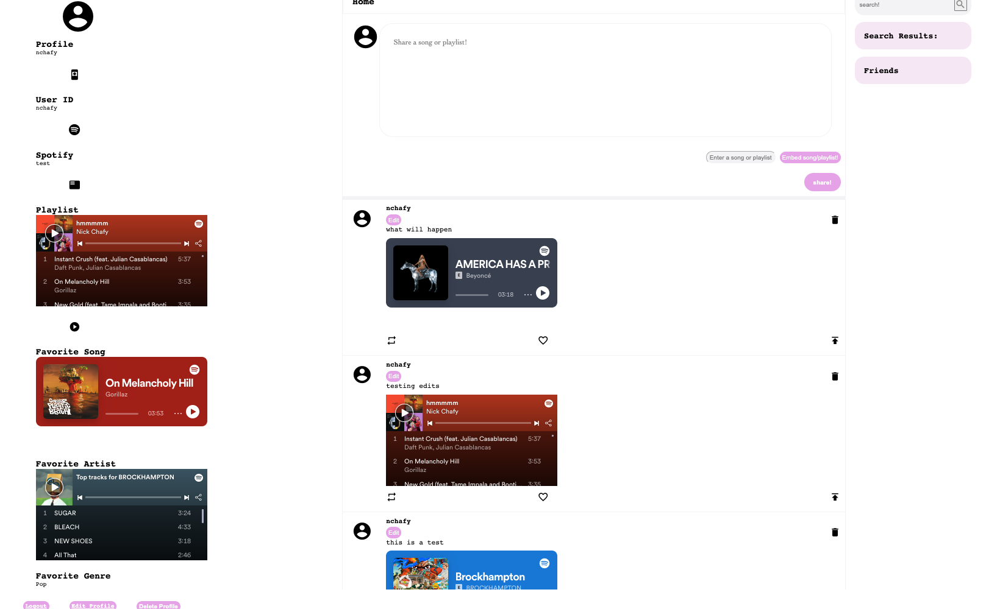
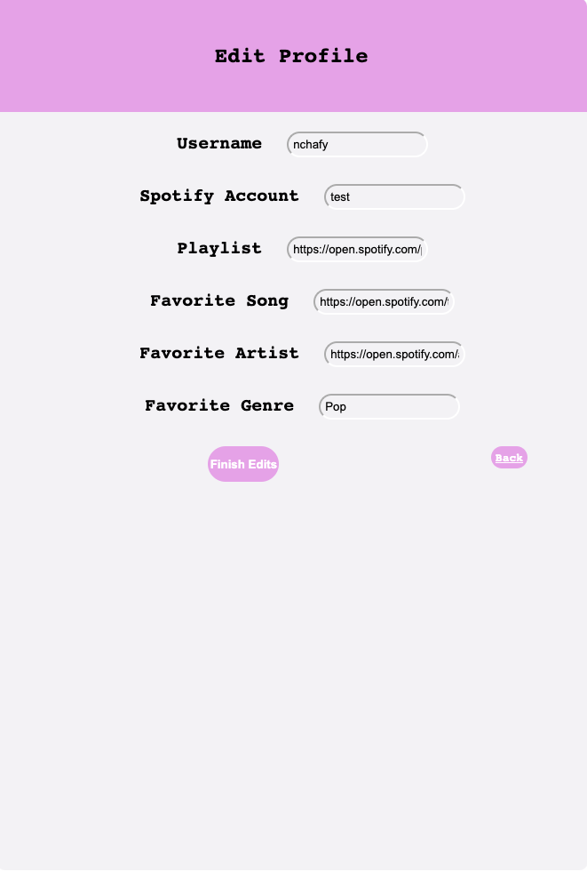
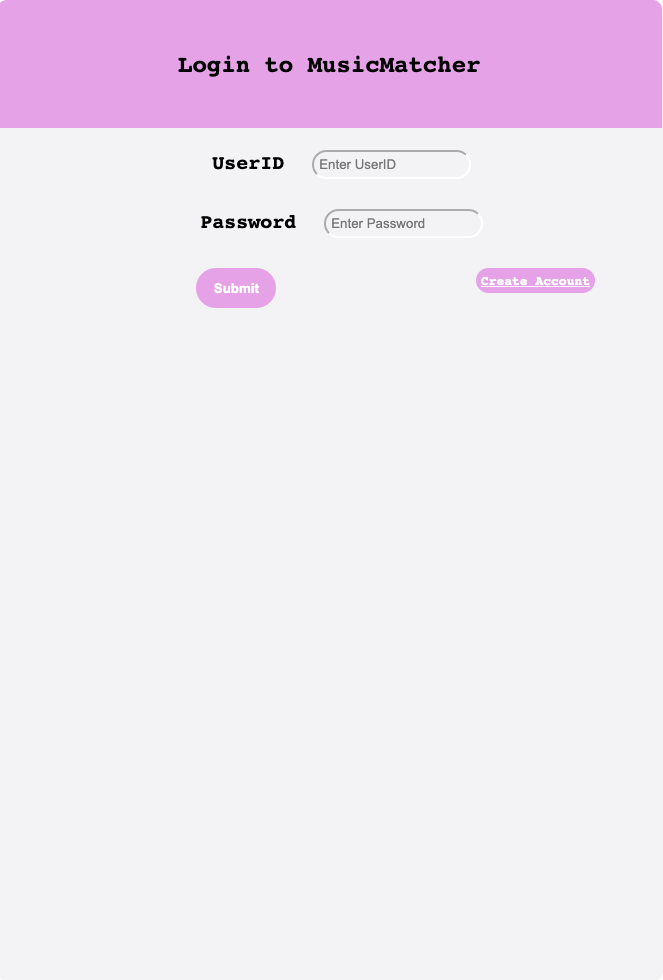
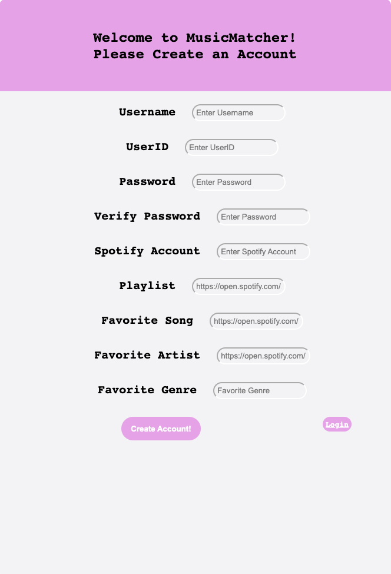

## Team-He
## Music-Matcher
## Fall 2022
## Overview

Music Matcher is an application that lets users from around the world share their favorite spotify songs and playlists. To get started, users can begin by creating an account with a unique user id and a password. Upon registration, useres can set information like username, spotify account, favorite playlist, favorite song, favorite artist, and favorite genre to make their accounts more representative of themselves. Once their account is created, users can start sharing their musical preferences by entering a short comment and the url of the song/playlist they'd like to share in their post(AKA chirp). The url will automatically be converted into an embedded audio playable box that other users too can listen to once the chirp is posted. Once posted, every user on the platform can see the chirp and interact with it. Users can post and rechirp(like retweeting) as well. Users can also edit and delete chirps that they have made too. Besides posting and interacting with other users' posts, they can edit/delete their profile, add other friends, and search for friends on the platform by typing in the username or user id of the friend they'd like to add as a friend. 

What makes Music Matcher such an innovative and attractive new platform is the simplicity and effectiveness in satisfying the needs of our target audience. The idea behind our app is simple: we want to make sharing music more fun and interactive. We target music lovers across the world and their urge to share music with friends and family. However, sometimes they are unable to due to their musical tastes deviating from current music trends, or because they do not know who they could share their taste in music with. Our application helps bridge this gap. Users from all over the world can see each others' posts, and interact with one another in a simple manner. Music Matcher benefits the average music enjoyer as well, saving them from the tedious task of asking their friends for music recommendations. Now, they can open our app and easily see recommendations from the world. In addition to this, it makes people's musical preferences more transparent, allowing users to form unexpected connections. Music is a universal language that connects people from around the world. We hope that Music Matcher connects people from around the world through the love for music.  

## Team Members
Nicholas Chafy - nchafy
Joseph Machiaverna - jmachiaverna
Stanley Araki - StanleyAraki
## User Interface
### Main View

This is the main view where the user will spend most of their time. It features a search bar to search for users, a feed of chirps (posts), a sidebar containing user information, and the ability to post their own chirp to the feed. 

For chirps that the user has posted, there is an edit and delete option associated with them. For all posts, the user can user the like button to like the post (*WARNING, using the like button feature too quickly may cause the website to crash. We were unable to figure out why. Please use the like feature slowly and sparingly*),
The user can also edit and delete their profile, as well as logout. When editing the profile, all fields must be filled in, and the fields are prefilled with the users' previous values.
In the search bar, users can search for other users, and friend them in the results tab. On friend, the friend bar will show the newly added friend. In the friends tab, you can unadd a friend, which will be seen on the subsequent reload.
### Edit Profile

This is the view that is seen when the user clicks the edit profile button. Upon edits, the profile in the database is updated, and when returning to the main feed, you will see the reflected changes. There is also a back button if you don't want to do any edits.
### Login Page

The login page. Also contains a button that goes to the registration page.
### Account Registration Page

The account registration page. Fairly self explanatory, expect the playlist. favorite song, and favorite artists fields should be filled in with a spotify playlist, song, and artist link respectively.
These links can be retrieved by right clicking on the respective item you want, going to share, and copying the item URL. We did not have time to integrate the spotify api to make this more streamlined.

example:
Playlist: https://open.spotify.com/playlist/37i9dQZF1F0sijgNaJdgit?si=87d5a0279e894300
Track: https://open.spotify.com/track/7AE1oyRpPGoSwDs8b9XBO0?si=25b89662424f4c1b
Artist: https://open.spotify.com/artist/1AhjOkOLkbHUfcHDSErXQs?si=BCcuttuSRhGD9q2ildHLEg
## APIs
We have 3 main objects that we need CRUD operations for. These are the profile, chirp, and friend objects, which are defined in the next section. We will need to be able to gets for many of these as well. The endpoints we are using for these operations are:
### Create
* **/register**
    CREATE one: This route creates a chirp post. This is used when users create chirp posts to share with the world. 
* **/createChirp**
    CREATE one: This route registers an account, creates a profile in the profiles table, and creates the salt and hash in the user_secrets table. This is used on click for the register page. 
* **/createLike**
    CREATE one: This route creates a like for a given chirp and user. This is used when a user likes someone's post.
* **/createFriend/:friend_id**
    CREATE one: This route creates a friend link given another user's user id. This is used when a user tries to add a friend.
### Read
* **/loadFeed**
    GET many: Gets all chirps posted ordered by timestamp. This is called whenever the page is refreshed, or when we want to update our current feed status. 
* **/profiles**
    GET many: This route gets all of the profiles from the profiles database. 
* **/profiles/:user_id**
    GET one: This route gets the profile associated with a specific user id. This is used when we load the profile for a specific user after login.
* **/search**
    GET many: This route gets all profiles that contain the search query in their username or user id. This is used when users type a username or user id to search for in the search bar on the top right section of our application. 
* **/sessionProfile**
    GET one: This route gets the session profile for a user. This is used when the user logs in to their account, to get the profile associated with their user id.
* **/likedChirps**
    GET many: This route gets the all of the liked chirps from the likedChirps table in our database. This is used when we reflect the like count of each chirp post on load
* **/likedChirps/:chirp_id**
    GET many: This route gets all of the chirps that a specific authenticated user has liked, given the chirp id. This is used when we reflect the like status of each chirp on load. 
* **/chirps/:user_id**
    GET many: This route gets all chirps associated with a specific authenticated user. We did not get to this, but it would be used to load chirps for a specific user.
* **/chirps/:chirp_id**
    GET one: This route is used to get a specific chirp, given the id of the chirp. 
* **/friends/:friend_id**
    GET one: This route is used to check if the current user is friends with the user defined by friend_id. 
* **/userFriends**
    GET many: This route will get all friend connections for a given signed in user, and corresponding favorite songs. This is used to load all friends for a specific when they log in. 
* **/friends**
    GET many: This route is used to return all user, friends pairs from the friends table. 
### Update 
* **/putProfile**
    UPDATE one: This route updates a given profile using the data from the profile fields' body in the edit-profile page. This is used when a user updates their profile. 
* **/putChirp**
    UPDATE one: This route edits a chirp post. This is used when users would like to edit a post they have made. 
### Delete
* **/deleteProfile**
    DELETE one: This route deletes a certain user's profile, as well as the associated user_secret entry. This is used when a user may want to delete their entire profile from their account
* **/deleteChirp/:chirp_id**
    DELETE one: This route is used when a user wants to delete a chirp they have made. 
* **/deleteFriend**
    DELETE many: This route deletes all friends for a given user. This is used when a user deletes their profile. 
* **/deleteFriend/:friend_id**
    DELETE one: This route deletes a specific friend for a given user. This is used when a user wants to remove a friend from their account.
* **/deleteLike/:chirp_id**
    DELETE one: This route unlikes a post given a chirp id. This is used when a user decides to unlike a post they have previously liked. 
## Database

profiles table:

| Column          | Data Type | Description                                            |
|-----------------|-----------|--------------------------------------------------------|
| user_name       | String    | The username of the profile                            |
| user_id         | String    | The id of the profile                                  |
| spotify_account | String    | Stores name of spotify account associated with profile |
| playlist        | String    | Stores text of link to Profile's spotify playlist      |
| favorite_song   | String    | Stores text of link to Profile's favorite song         | 
| favorite_genre  | String    | Stores the profile's favorite genre of music           |
| favorite_artist | String    | Stores the profile's favorite music artist             |

chirps table:

| Column          | Data Type | Description                                            |
|-----------------|-----------|--------------------------------------------------------|
| chirp_id        | Serial    | A unique number given to each chirp for identification |
| timestamp       | Integer   | The time (down to millisecond) this chirp was posted   |
| user_name       | String    | The username of the profile that posted this chirp     |
| chirp_text      | String    | The text that the user typed into this chirp (content) |
| user_id         | String    | The unique identifier of the user who posted this chirp|
| shared_song     | String    | Stores text of link to song shared in the chirp        |
| like_count      | Integer   | The number of likes that this chirp has gotten         |
| share_count     | Integer   | The number of times this chirp was shared              | 

friends table:

| Column          | Data Type | Description                                            |
|-----------------|-----------|--------------------------------------------------------|
| user_id         | String    | The id of the user that is making a friend             |
| friend_id       | Integer   | The id of the user that the user_id is friends with    |

likedchirps table:

| Column          | Data Type | Description                                            |
|-----------------|-----------|--------------------------------------------------------|
| user_id         | String    | The id of the user that has liked the post             |
| chirp_id        | Integer   | The id of the chirp the user posted                    |

user_secrets table:

| Column          | Data Type | Description                                            |
|-----------------|-----------|--------------------------------------------------------|
| user_id         | String    | The id that the salt and hash correspond to            |
| salt            | String    | The salt of the hashed/encrypted password              |
| hash            | String    | The hash of the hashed/encrypted password              |

## URL Routes/Mappings

* **/main**
    This route is used to lead users to the main view of the application, after being authenticated through their accounts
* **/login**
    This route is used to leads users to the login page of the application. It also handles post data from the login.html form. 
* **/logout**
    This route is used to handle users logging out, taking them back to the login page. 
* **/register**
    This route handles new user registration, and also serves the registration page as well. This is used when registering new users.
* **/loadFeed**
    This route loads a user's feed, getting all chirps posted ordered by timestamp. This is called whenever the page is refreshed, or when we want to update our current feed status. 
* **/profiles/:user_id**
    This route gets the profile associated with a specific user id. This is used when we load the profile for a specific user after login.
* **/search**
    This route gets all profiles that contain the search query in their username or user id. This is used when users type a username or user id to search for in the search bar on the top right section of our application. 
* **/sessionProfile**
    This route gets the session profile for a user. This is used when the user logs in to their account, to get the profile associated with their user id.
* **/likedChirps/:chirp_id**
    This route gets all of the chirps that a specific authenticated user has liked, given the chirp id. This is used when we reflect the like status of each chirp on load. 
* **/chirps**
    This route gets all chirps in the database. This is used when we get chirps on load
* **/chirps/:user_id**
    This route gets all chirps associated with a specific authenticated user. This is used when chirps for a specific users are being loaded in
* **/chirps/:chirp_id**
    This route is used to get a specific chirp, given the id of the chirp. 
* **/friends/:friend_id**
    This route is used to check if the current user is friends with the user defined by friend_id. 
* **/userFriends**
    This route will get all friend connections for a given signed in user, and corresponding favorite songs. This is used to load all friends for a specific when they log in. 
* **/createChirp**
    This route creates a chirp post. This is used when users create chirp posts to share with the world. 
* **/createLike**
    This route creates a like for a given chirp and user. This is used when a user likes someone's post.
* **/createFriend/:friend_id **
    This route creates a friend link given another user's user id. This is used when a user tries to add a friend.
* **/editProfile**
    This route redirects users to the edit profile page. This is used when users want to edit their current profile.
* **/putProfile**
    This route updates a given profile using the data from the profile fields' body in the edit-profile page. This is used when a user updates their profile. 
* **/putChirp**
    This route edits a chirp post. This is used when users would like to edit a post they have made. 
* **/deleteProfile**
    This route deletes a certain user's profile. This is used when a user may want to delete their entire profile from their account
* **/deleteChirp/:chirp_id**
    This route is used when a user wants to delete a chirp they have made. 
* **/deleteFriend**
    This route deletes all friends for a given user. This is used when a user deletes their profile. 
* **/deleteFriend/:friend_id**
    This route deletes a specific friend for a given user. This is used when a user wants to remove a friend from their account.
* **/deleteLike/:chirp_id**
    This route unlikes a post given a chirp id. This is used when a user decides to unlike a post they have previously liked. 

## Authentication/Authorization

Users are authenticated through a unique user id and a password. When users create a password, we hash it using a wrapper called miniCrypt and store the salt(random string) and hash combination for the password in a table along with the user's user id. This way, user information is kept secure and private, even to us administrators. When a user tries to log in to their account and authenticate themselves, their entered user id and password is matched against the tuple with the matching user id in the table. Then, their entered password is hashed and the hashed value is checked with the stored hash+salt value. If they both match, then authentication is successful and users are redirected to their account's home page. If authentication fails, then they are directed back to the login page of the application. 

Logged-in/authenticated users have full access to all of the features for our applications. Users who have not registered/logged-in do not have any access to our features, and will need to create an account or log in first. There are no permission differences between specific users, so an administrator account has the same privileges as the average user. This means that the UI views available for all users is the same. 

## Division of Labor

Nick Chafy: 
   From milestone 1: Worked on mainview variations and profile setup in wireframe. Added non-post components to the mainview feed in HTML/CSS Implementation. Implemented the initial account creation html/css.

   From milestone 2: Implemented PUT and DELETE server endpoint handling and API, worked on integrating project with heroku with express.js and dependency management. Implemented add friend functionality with HTML updates and dummy information.

   From milestone 3: Redesigned the chirp object and database to conform with requirements. Implemented the chirps and profiles tables. Resolved issues with our endpoints throwing errors, especially POST and PUT for chirp, and PUT for profiles. Integrated the createChirp endpoint with the front end for actual posting (post_chirp). Added linting to the database so that special characters in all String fields would be checked for potential unexpected (or malicious) uses of database. Implemented putProfile. Some HTML/CSS prettifying. Implemented profile creation front end and connected it with back end and database. 

   Since milestone 3: Implemented search, add friend, unfriend, edit post, delete post, edit profile, delete profile, and registration back-end AND front end. Created specific endpoints for server for these, as well as refactored database for them. Made front-end view for all of these fairly pretty, and helped debug other portions of the code. Implemented edit.html, login.html, and register.html as well as any associated .js files.

    Added comments to the code, and tried to make main.js more readable with comments in post_chirp and some refactoring to break it up. Wrote API section of final.md

Joseph Machiaverna: 
From Milestone 2: Coded the CREATE endpoint for the API. Also wrote the create, update, and delete descriptions for the description of the API.

From Milestone 3: Converted a lot of our endpoints to use the postgreSQL database. Added some more endpoints which included /Chirps/:user_name in order to obtain all of the posts written by a single user and /Profiles/:user_id in order to obtain a single profile. Implemented the new friends table and added Create, Read, and Delete endpoints for it. Also added a endpoint that enables us to obtain a list of friends for a user. Updated update_friends_db in main.js to work with our new model. Fixed various bugs hindering our project across our code.

Since Milestone 3: Added a liking feature to the program. Created a new table called likedChirps and endpoints that can, post, retrieve, and delete entries from the database. Added event listener to like button so when it is clicked, it will turn red and increment the like_count for that specific chirp. Made it so each person can only like a post once. Also made sure that the posts that the signed in user liked stay liked on refresh. Connected friend features to the UI. Wrote code that makes sure that a user can only add another specific user as a friend once. Also wrote code for that when a friend is added, the friend will be displayed on the users UI. Various bug fixes and typo fixes.

Stanley Araki: 
   From Milestone 1: Worked on creating mainview in the wireframe, as well as implementing the mainview in HTML/CSS implementation.
Organized Github structure and added data interactions, wireframe screenshots to this document(doc/milestone1.md).  

   From Milestone 2: Worked on initial milestone2.md setup, READ API, serving files with Express.js and HTML updates on the client side with data returned from server side endpoints for READ API.

   From Milestone 3: Made design choices and divided labor to each group member. Implemented backend features and key bug fixes related to posting 'chirps'(basically tweets). As a result, posts from the past from users in previous sessions are shown on a user's feed whenever the page is loaded. Restructured endpoints code, especially the endpoint called on load to create key tables needed. Also used Spotify embeddings to allow users to post links that would automatically converted to songs, albums, and playlists. This also is implemented for user profiles as well, so links get converted to their embedded forms on their profiles. 

   Since Milestone 3: Mostly focused on fixing small bugs here and there as well as small prettifications on existing code. Also spent time in class with group members discussing login authentication logic and implemented the findUser(), addUser(), and validatePassword() functions used for login. Also wrote out the authentication/authorization, URL Routes/Mapping, Database, and Conclusion section of the final.md file. 

## Conclusion

We believe that the overall experience of developing a product as one unified group was very enriching and meaningful. Throughout our development cycle, we were constantly discussing how to approach the next step, conducting research and testing out different ways when necessary. When we ran into errors we effectively communicated with both our team and the TA's about what we were facing and if they could provide any assistance. Through this, we first learned the importance of creating an elaborate design doc, where implementation steps are written out elaborately with thoughtful considerations. Our team spent a lot of time toward the beginning to discuss how we will implement different parts of our application, like how we could design the posts, how to implement a feature to add friends, and how we could embed playable spotify audios in our app. This greatly benefited us in the end because it let us keep track of our ideas and our progress during development. It also helped us coordinate what each member would work on, to make work go smoother. 
During our development, we also learned that it is helpful to have another group member take a look at a part that we were struggling on. We found that having a fresh pair of eyes to help with debugging makes the process run much faster because it offers a different perspective on the code. It also facilitates discussion on how something is implemented as well, leading to more efficient and neat code in the end. Besides these points, we also learned technical skills as well, like how to use PSQL in Node.js, how to serve files using express.js, how to connect the front and back end of an application, and many more. 

Despite our success, our team also encountered a few difficulties as well. One large hurdle we faced was that heroku was not working for our application for a very long time. This was because faker.js was incompatible with the version of heroku, and this was resolved by removing the faker.js dependency. However, figuring this issue out took away several days of development from us, and left us scrambling to finish other parts. Another issue we had was that, because we used the psql database on Heroku we could only test our changes in our code by deploying the code on Heroku. Each time we wanted to see if a minor bug fix or change was successful, we had to push everything to our main repository and then deploy it to see if it worked or not. This made our development speed considerably slower, as we needed to wait for the entire project to build each time we wanted to test out a change. Finally, we encountered some technical issues with login authentication as well. When we were given the code for the login authentication, we did not really know how to use that code and how to connect that code snippet with our existing codebase. This also slowed down our progress as we spent some time figuring out how we could use the provided code that we were supposed to use. 
In retrospect, we believe that there could have been more guidance on how to use the tools that were provided to us. We feel that sometimes we were expected to know things that we really did not know, like Heroku, how to set up our application locally, and how to use the login authentication code. A good example of this was for milestone 2 when we were supposed to create routes. For this milestone we were expected to use express.js to serve files and also set up endpoints that we would use later on in the project. However, express.js and how to use it was covered the next day after the milestone was already due, which felt unintuitive as it is too late at that point. We ultimately had to spend a lot of time figuring out how to implement the endpoints and serve our files on our own, which added stress and slowed development. In a simlar sense, for the login authentication code we feel that we were just given the code and expeced to understand it. Only after one of our group members asked the professor in class, were we able to understand and use that code. The same goes for Heroku as well, where our group member spent a lot of time trying to figure it out on their own due to a lack of instruction. If there was more documentation and specific instruction given to us for the provided tools, then we believe that would have been very helpful. 
Our project also has a few warnings that we would like the users to take note of and be careful about:
1. **Please do not press the like button very fast multiple times**: Our like button is very sensitive, and clicking on the button several times very quickly may crash our server. 
2. **Please do not try to edit more than one chirp at a time**: Our chirp edit feature is complex. Editing two chirps at the same time may lead to an unwanted race condition or a lock in our database. This could be fixed by configuring transaction concurrency levels in our database, but due to time constriants we were not able to fix this small issue. In the meantime, please edit one chirp at a time. 
3.**Audio does not play the first time play button is pressed** For an unknown reason, the audio for an embedded spotify song/playlist will not play the first time the play button is pressed. To play audio successfully, please press play and press it again to pause it, followed by another press to play it again. This will let users play the audio. 
In the end, we satisfied and proud with out app, Music Matcher. 
